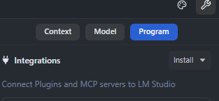
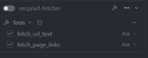

# rs-mcp-url-fetcher

!!! WIP — in progress !!!

I am currently working on this project. Planned short-term tasks:

- [ ] Optimize response text (truncation, filtering, clearer formatting)
- [ ] Release build


This small MCP (Model Context Protocol) STDIO server binary is intended to provide controlled web access to LM Studio models

Exposed tools:

- `fetch_url_text` — fetches the HTML body content of a URL and returns it as plain text (with optional truncation).
- `fetch_page_links` — extracts all href links from a page and returns them as JSON text.

Implementation note: this project uses the `mcp-protocol-sdk` Rust crate and implements MCP over STDIO.

## Why this tool?

LM Studio can launch and call external tools over MCP. This repository provides a small, auditable bridge that allows models to retrieve web content without giving the model direct network access. This enables:

- explicit input validation (allow only specific hosts/protocols),
- rate limiting and timeouts,
- content filtering (e.g. extract only text, avoid executing scripts),

## LM Studio integration (short)

1. Build or download the binary (see Build).
2. Configure the MCP server in LM Studio (via the Integrations dialog):

When you click the "Install" button and then choose "Edit mcp.json", LM Studio opens a dialog where you can paste or edit the integrations JSON directly.



Paste JSON like the following into the dialog and save it. :

```json
{
    "mcpServers": {
        "url-fetcher": {
            "command": "path/to/your/lm_mcp_server"
        }
    }
}
```

If you already have other tools configured in `mcp.json`, you can add this server without removing them.
On Windows you must escape backslashes in JSON (for example: `C:\\path\\to\\lm_mcp_server.exe`).

3. Enable the tool in LM Studio. The application will perform the MCP handshake and call `tools/list`. Once the handshake succeeds, the available tools appear in the integrations/plugins list.

After installation you should see the tools listed as an integration/plugin:



## Build

Requires Rust and cargo.

```powershell
cargo build --release
```

